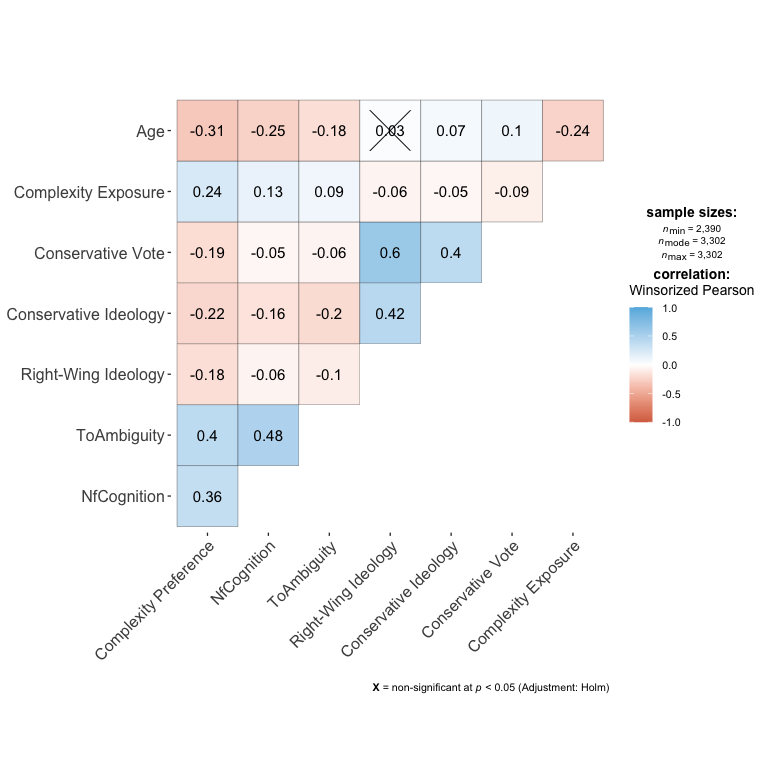

Data Analysis
================

- [Correlation Matrix all variables](#correlation-matrix-all-variables)
- [H1: Individuals with a higher PNC are more likely to exhibit greater
  tolerance for ambiguity (H1a), demonstrate a higher need for cognition
  (H1b)](#h1-individuals-with-a-higher-pnc-are-more-likely-to-exhibit-greater-tolerance-for-ambiguity-h1a-demonstrate-a-higher-need-for-cognition-h1b)
  - [DV = PNC](#dv--pnc)
- [H2: Individuals with a lower PNC are more likely to have a more
  conservative political orientation (H2a) and will vote for
  conservative political parties
  (H2b).](#h2-individuals-with-a-lower-pnc-are-more-likely-to-have-a-more-conservative-political-orientation-h2a-and-will-vote-for-conservative-political-parties-h2b)

## Correlation Matrix all variables

## H1: Individuals with a higher PNC are more likely to exhibit greater tolerance for ambiguity (H1a), demonstrate a higher need for cognition (H1b)

### DV = PNC

PNC is predicted by…. - TOA (positive) - NFC (positive) - age - sex -
education

1.  Significant effect of XXX = more TOA leads to more XXX

| term              | estimate | std.error | statistic | p.value | lower | upper |
|:------------------|---------:|----------:|----------:|--------:|------:|------:|
| (Intercept)       |     2.53 |      0.05 |      47.5 |     0.0 |  2.43 |  2.64 |
| ToA               |     0.28 |      0.02 |      16.5 |     0.0 |  0.25 |  0.31 |
| NfC               |     0.05 |      0.01 |       5.8 |     0.0 |  0.03 |  0.07 |
| Gender: Male      |    -0.01 |      0.01 |      -1.1 |     0.3 | -0.03 |  0.01 |
| Education: Low    |    -0.08 |      0.01 |      -6.3 |     0.0 | -0.10 | -0.05 |
| Education: Medium |    -0.04 |      0.01 |      -4.2 |     0.0 | -0.06 | -0.02 |
| Age               |     0.00 |      0.00 |     -11.0 |     0.0 |  0.00 |  0.00 |

## H2: Individuals with a lower PNC are more likely to have a more conservative political orientation (H2a) and will vote for conservative political parties (H2b).

| term              | estimate | std.error | statistic | p.value | lower | upper | model      |
|:------------------|---------:|----------:|----------:|--------:|------:|------:|:-----------|
| (Intercept)       |     3.72 |      0.02 |    211.66 |    0.00 |  3.68 |  3.75 | Left-Right |
| Ideology          |     0.00 |      0.00 |     -1.58 |    0.11 |  0.00 |  0.00 | Left-Right |
| Gender: Male      |     0.00 |      0.01 |      0.25 |    0.80 | -0.02 |  0.02 | Left-Right |
| Education: Low    |    -0.16 |      0.01 |    -12.11 |    0.00 | -0.19 | -0.13 | Left-Right |
| Education: Medium |    -0.09 |      0.01 |     -9.24 |    0.00 | -0.11 | -0.07 | Left-Right |
| Age               |     0.00 |      0.00 |    -13.15 |    0.00 |  0.00 |  0.00 | Left-Right |

| term              | estimate | std.error | statistic | p.value | lower | upper | model                    |
|:------------------|---------:|----------:|----------:|--------:|------:|------:|:-------------------------|
| (Intercept)       |     3.79 |      0.02 |     197.2 |    0.00 |  3.75 |  3.83 | Progressive-Conservative |
| Ideology          |    -0.02 |      0.00 |      -8.9 |    0.00 | -0.02 | -0.02 | Progressive-Conservative |
| Gender: Male      |     0.01 |      0.01 |       1.6 |    0.11 |  0.00 |  0.03 | Progressive-Conservative |
| Education: Low    |    -0.15 |      0.01 |     -11.6 |    0.00 | -0.17 | -0.12 | Progressive-Conservative |
| Education: Medium |    -0.09 |      0.01 |      -8.7 |    0.00 | -0.11 | -0.07 | Progressive-Conservative |
| Age               |     0.00 |      0.00 |     -13.0 |    0.00 |  0.00 |  0.00 | Progressive-Conservative |

