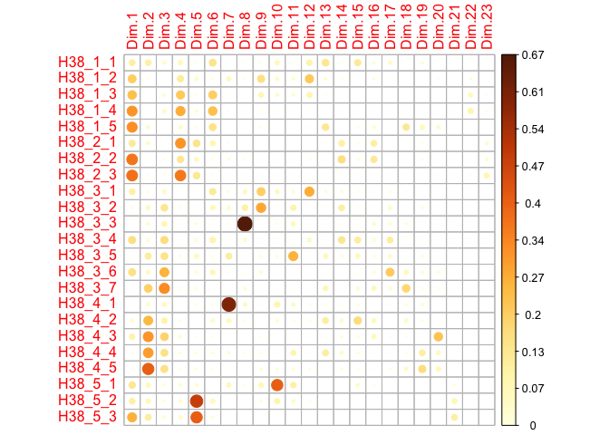
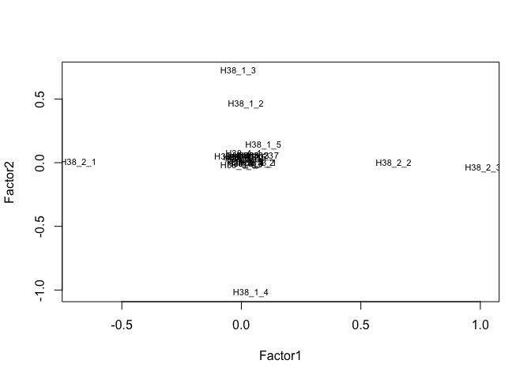

Prepare Data
================

- [Required Packages &
  Reproducibility](#required-packages--reproducibility)
- [Tidy Data](#tidy-data)
- [Factor Analyses of PNC](#factor-analyses-of-pnc)
- [Reliability of Scales](#reliability-of-scales)
- [Save Data for Analysis](#save-data-for-analysis)

## Required Packages & Reproducibility

``` r
rm(list=ls())
source(here::here("src/lib/functions.R"))
#renv::snapshot()
```

## Tidy Data

``` r
load(here("data/raw-private/cleaned_data_w2.RData")) 
load(here("data/raw-private/cleaned_data_w3.RData"))

source(here("src/data-processing/clean_data.R"))
```

## Factor Analyses of PNC

**H38** == PNC (21 questions)

``` r
source(here("src/data-processing/factor_analyses.R"))

#PCA Info
summary(res_pca)
```

    ## Importance of components:
    ##                          PC1    PC2    PC3    PC4    PC5    PC6    PC7    PC8
    ## Standard deviation     1.772 1.5026 1.4221 1.3226 1.2485 1.1853 1.0224 1.0069
    ## Proportion of Variance 0.136 0.0982 0.0879 0.0761 0.0678 0.0611 0.0454 0.0441
    ## Cumulative Proportion  0.136 0.2346 0.3226 0.3986 0.4664 0.5275 0.5729 0.6170
    ##                           PC9   PC10   PC11   PC12  PC13   PC14   PC15   PC16
    ## Standard deviation     0.9770 0.9401 0.9067 0.8856 0.858 0.8434 0.8333 0.7903
    ## Proportion of Variance 0.0415 0.0384 0.0357 0.0341 0.032 0.0309 0.0302 0.0272
    ## Cumulative Proportion  0.6585 0.6969 0.7327 0.7668 0.799 0.8297 0.8599 0.8871
    ##                          PC17   PC18  PC19   PC20    PC21  PC22    PC23
    ## Standard deviation     0.7446 0.7342 0.711 0.6668 0.45589 0.429 0.40239
    ## Proportion of Variance 0.0241 0.0234 0.022 0.0193 0.00904 0.008 0.00704
    ## Cumulative Proportion  0.9112 0.9346 0.957 0.9759 0.98496 0.993 1.00000

``` r
eig_val
```

|        | eigenvalue | variance.percent | cumulative.variance.percent |
|:-------|-----------:|-----------------:|----------------------------:|
| Dim.1  |       3.14 |             13.7 |                          14 |
| Dim.2  |       2.26 |              9.8 |                          23 |
| Dim.3  |       2.02 |              8.8 |                          32 |
| Dim.4  |       1.75 |              7.6 |                          40 |
| Dim.5  |       1.56 |              6.8 |                          47 |
| Dim.6  |       1.40 |              6.1 |                          53 |
| Dim.7  |       1.05 |              4.5 |                          57 |
| Dim.8  |       1.01 |              4.4 |                          62 |
| Dim.9  |       0.95 |              4.2 |                          66 |
| Dim.10 |       0.88 |              3.8 |                          70 |
| Dim.11 |       0.82 |              3.6 |                          73 |
| Dim.12 |       0.78 |              3.4 |                          77 |
| Dim.13 |       0.74 |              3.2 |                          80 |
| Dim.14 |       0.71 |              3.1 |                          83 |
| Dim.15 |       0.69 |              3.0 |                          86 |
| Dim.16 |       0.62 |              2.7 |                          89 |
| Dim.17 |       0.55 |              2.4 |                          91 |
| Dim.18 |       0.54 |              2.3 |                          93 |
| Dim.19 |       0.51 |              2.2 |                          96 |
| Dim.20 |       0.44 |              1.9 |                          98 |
| Dim.21 |       0.21 |              0.9 |                          98 |
| Dim.22 |       0.18 |              0.8 |                          99 |
| Dim.23 |       0.16 |              0.7 |                         100 |

``` r
fviz_eig(res_pca, fill.var="blue")
```


``` r
var #PCA results for variables
```

    ## Principal Component Analysis Results for variables
    ##  ===================================================
    ##   Name       Description                                    
    ## 1 "$coord"   "Coordinates for the variables"                
    ## 2 "$cor"     "Correlations between variables and dimensions"
    ## 3 "$cos2"    "Cos2 for the variables"                       
    ## 4 "$contrib" "contributions of the variables"

``` r
corrplot(var$cos2, is.corr=FALSE)
```



``` r
fviz_cos2(res_pca, choice = "var", axes = 1:2)
```


``` r
fviz_pca_var(res_pca,
             col.var = "cos2", # Color by the quality of representation
             gradient.cols = c("darkorchid4", "gold", "darkorange"),
             repel = TRUE
             )
```


``` r
grid.arrange(a,b, ncol=2, top='Contribution of the variables to the first two PCs')
```


``` r
# EFA Info
KMO(df2) #Evaluate data, scores <0.5 should be removed (0 in our case)
```

    ## Kaiser-Meyer-Olkin factor adequacy
    ## Call: KMO(r = df2)
    ## Overall MSA =  0.58
    ## MSA for each item = 
    ## H38_1_1 H38_1_2 H38_1_3 H38_1_4 H38_1_5 H38_2_1 H38_2_2 H38_2_3 H38_3_1 H38_3_2 
    ##    0.70    0.46    0.48    0.50    0.76    0.45    0.53    0.53    0.77    0.66 
    ## H38_3_3 H38_3_4 H38_3_5 H38_3_6 H38_3_7 H38_4_1 H38_4_2 H38_4_3 H38_4_4 H38_4_5 
    ##    0.68    0.77    0.68    0.72    0.67    0.60    0.76    0.69    0.71    0.70 
    ## H38_5_1 H38_5_2 H38_5_3 
    ##    0.53    0.49    0.55

``` r
cortest.bartlett(df2)#Bartlett’s test for sphericity
```

    ## $chisq
    ## [1] 5612
    ## 
    ## $p.value
    ## [1] 0
    ## 
    ## $df
    ## [1] 253

``` r
ev$values
```

    ##  [1] 3.11 2.22 1.95 1.68 1.59 1.47 1.05 1.00 0.96 0.91 0.85 0.79 0.75 0.72 0.68
    ## [16] 0.62 0.58 0.54 0.50 0.45 0.22 0.19 0.17

``` r
scree(df2, pc=FALSE) 
```


``` r
fa.parallel(df2, fa="fa")
```


    ## Parallel analysis suggests that the number of factors =  6  and the number of components =  NA

``` r
print(fit, digits=2, cutoff=0.3, sort=TRUE)
```

    ## 
    ## Call:
    ## factanal(x = df2, factors = Nfacs, rotation = "promax")
    ## 
    ## Uniquenesses:
    ## H38_1_1 H38_1_2 H38_1_3 H38_1_4 H38_1_5 H38_2_1 H38_2_2 H38_2_3 H38_3_1 H38_3_2 
    ##    0.97    0.77    0.48    0.00    0.83    0.56    0.57    0.00    0.89    0.95 
    ## H38_3_3 H38_3_4 H38_3_5 H38_3_6 H38_3_7 H38_4_1 H38_4_2 H38_4_3 H38_4_4 H38_4_5 
    ##    0.96    0.65    0.92    0.43    0.81    0.95    0.80    0.51    0.66    0.52 
    ## H38_5_1 H38_5_2 H38_5_3 
    ##    0.85    0.47    0.00 
    ## 
    ## Loadings:
    ##         Factor1 Factor2 Factor3 Factor4 Factor5
    ## H38_2_1 -0.68                                  
    ## H38_2_2  0.64                                  
    ## H38_2_3  1.01                                  
    ## H38_1_3          0.72                          
    ## H38_1_4         -1.02                          
    ## H38_5_2                  0.74                  
    ## H38_5_3                  1.01                  
    ## H38_4_3                          0.69          
    ## H38_4_4                          0.59          
    ## H38_4_5                         -0.70          
    ## H38_3_4                                  0.58  
    ## H38_3_6                                  0.76  
    ## H38_1_1                                        
    ## H38_1_2          0.46                          
    ## H38_1_5                                        
    ## H38_3_1                                  0.31  
    ## H38_3_2                                        
    ## H38_3_3                                        
    ## H38_3_5                                        
    ## H38_3_7                                 -0.45  
    ## H38_4_1                                        
    ## H38_4_2                          0.44          
    ## H38_5_1                 -0.35                  
    ## 
    ##                Factor1 Factor2 Factor3 Factor4 Factor5
    ## SS loadings       1.93    1.82    1.75    1.57    1.49
    ## Proportion Var    0.08    0.08    0.08    0.07    0.06
    ## Cumulative Var    0.08    0.16    0.24    0.31    0.37
    ## 
    ## Factor Correlations:
    ##         Factor1 Factor2 Factor3 Factor4 Factor5
    ## Factor1   1.000   0.225    0.25   0.035    0.15
    ## Factor2   0.225   1.000    0.23   0.011    0.19
    ## Factor3   0.255   0.226    1.00   0.070    0.19
    ## Factor4   0.035   0.011    0.07   1.000    0.11
    ## Factor5   0.149   0.186    0.19   0.109    1.00
    ## 
    ## Test of the hypothesis that 5 factors are sufficient.
    ## The chi square statistic is 1038 on 148 degrees of freedom.
    ## The p-value is 1.6e-133

``` r
load <- fit$loadings[,1:2]
plot(load,type="n") # set up plot
text(load,labels=names(df2),cex=.7)
```



``` r
fa.diagram(loads)
```


``` r
# CFA Info
```

## Reliability of Scales

**H38** == PNC (21 questions) **H36** == NFC (6 questions) **H37** ==
TOA (13 questions) **H40** == MCE (14 questions) – if H40_i == 1, we
move on to H41_i and H42_i

``` r
source(here("src/data-processing/scales.R"))
```


``` r
pnc_omega
```

    ## Omega 
    ## Call: omegah(m = m, nfactors = nfactors, fm = fm, key = key, flip = flip, 
    ##     digits = digits, title = title, sl = sl, labels = labels, 
    ##     plot = plot, n.obs = n.obs, rotate = rotate, Phi = Phi, option = option, 
    ##     covar = covar)
    ## Alpha:                 0.52 
    ## G.6:                   0.59 
    ## Omega Hierarchical:    0.45 
    ## Omega H asymptotic:    0.73 
    ## Omega Total            0.62 
    ## 
    ## Schmid Leiman Factor loadings greater than  0.2 
    ##             g   F1*  F2*   F3*   h2    u2   p2
    ## H38_1_1  0.45                  0.21  0.79 0.97
    ## H38_1_2  0.29  0.30            0.18  0.82 0.49
    ## H38_1_3  0.26  0.61            0.44  0.56 0.16
    ## H38_1_4- 0.26  0.99            1.05 -0.05 0.07
    ## H38_1_5  0.76                  0.58  0.42 0.99
    ## H38_2_1                        0.03  0.97 0.11
    ## H38_3_1  0.32                  0.11  0.89 0.94
    ## H38_3_3                        0.01  0.99 0.96
    ## H38_3_4  0.29                  0.10  0.90 0.87
    ## H38_3_5                        0.05  0.95 0.62
    ## H38_4_1                        0.03  0.97 0.26
    ## H38_4_2                   0.46 0.25  0.75 0.13
    ## H38_4_3                   0.74 0.57  0.43 0.05
    ## H38_5_2-                       0.02  0.98 0.45
    ## 
    ## With Sums of squares  of:
    ##    g  F1*  F2*  F3* 
    ## 1.32 1.46 0.00 0.85 
    ## 
    ## general/max  0.9   max/min =   327
    ## mean percent general =  0.5    with sd =  0.38 and cv of  0.75 
    ## Explained Common Variance of the general factor =  0.36 
    ## 
    ## The degrees of freedom are 52  and the fit is  0.34 
    ## The number of observations was  1000  with Chi Square =  336  with prob <  4.2e-43
    ## The root mean square of the residuals is  0.04 
    ## The df corrected root mean square of the residuals is  0.05
    ## RMSEA index =  0.074  and the 10 % confidence intervals are  0.066 0.082
    ## BIC =  -24
    ## 
    ## Compare this with the adequacy of just a general factor and no group factors
    ## The degrees of freedom for just the general factor are 77  and the fit is  1.4 
    ## The number of observations was  1000  with Chi Square =  1349  with prob <  1.9e-231
    ## The root mean square of the residuals is  0.1 
    ## The df corrected root mean square of the residuals is  0.11 
    ## 
    ## RMSEA index =  0.13  and the 10 % confidence intervals are  0.12 0.14
    ## BIC =  817 
    ## 
    ## Measures of factor score adequacy             
    ##                                                  g F1*   F2*  F3*
    ## Correlation of scores with factors            0.82 1.0  0.05 0.79
    ## Multiple R square of scores with factors      0.68 1.1  0.00 0.62
    ## Minimum correlation of factor score estimates 0.35 1.2 -0.99 0.24
    ## 
    ##  Total, General and Subset omega for each subset
    ##                                                  g  F1*  F2*  F3*
    ## Omega total for total scores and subscales    0.62 0.67 0.58 0.34
    ## Omega general for total scores and subscales  0.45 0.12 0.57 0.28
    ## Omega group for total scores and subscales    0.17 0.56 0.00 0.06

``` r
rel_scales
```


## Save Data for Analysis

``` r
d <- d |> 
  select(id:E2_2, PNC, TOA, NFC, MCE)
save(d, file = here("data/intermediate/data_for_analyses.RData"))
```
