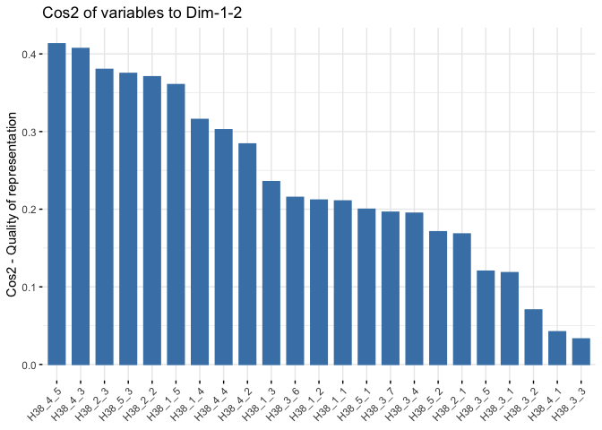
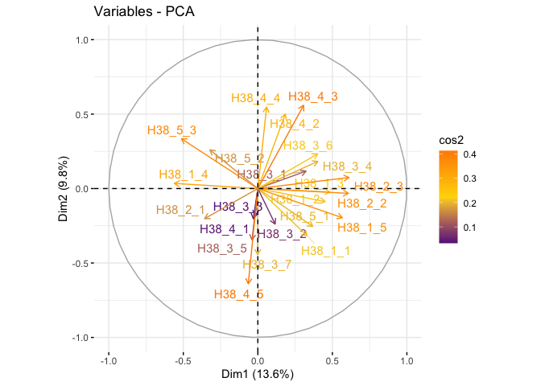
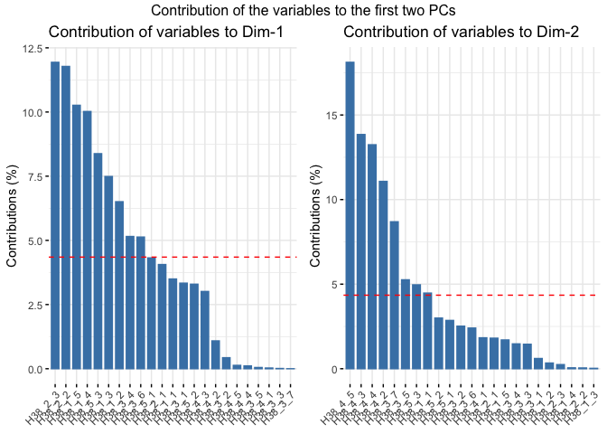
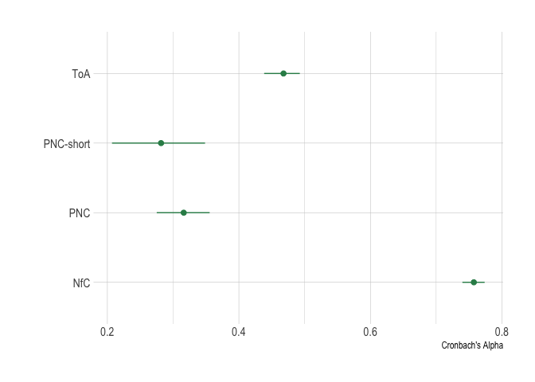

Prepare Data
================

- [Required Packages &
  Reproducibility](#required-packages--reproducibility)
- [Tidy Data](#tidy-data)
- [Factor Analyses of PNC](#factor-analyses-of-pnc)
- [Reliability of Scales](#reliability-of-scales)
- [Save Data for Analysis](#save-data-for-analysis)

## Required Packages & Reproducibility

``` r
rm(list=ls())
source(here::here("src/lib/functions.R"))
#renv::snapshot()
```

## Tidy Data

``` r
load(here("data/raw-private/cleaned_data_w2.RData")) 
load(here("data/raw-private/cleaned_data_w3.RData"))

source(here("src/data-processing/clean_data.R"))
```

## Factor Analyses of PNC

**H38** == PNC (21 questions)

``` r
source(here("src/data-processing/factor_analyses.R"))

#PCA Info
summary(res_pca)
```

    ## Importance of components:
    ##                          PC1    PC2    PC3   PC4    PC5    PC6    PC7    PC8
    ## Standard deviation     1.940 1.1137 1.1062 1.059 1.0537 1.0265 1.0201 0.9997
    ## Proportion of Variance 0.171 0.0564 0.0556 0.051 0.0505 0.0479 0.0473 0.0454
    ## Cumulative Proportion  0.171 0.2274 0.2830 0.334 0.3845 0.4324 0.4797 0.5251
    ##                          PC9  PC10   PC11   PC12   PC13   PC14  PC15   PC16
    ## Standard deviation     0.972 0.961 0.9535 0.9351 0.9137 0.8999 0.878 0.8663
    ## Proportion of Variance 0.043 0.042 0.0413 0.0398 0.0379 0.0368 0.035 0.0341
    ## Cumulative Proportion  0.568 0.610 0.6514 0.6912 0.7291 0.7659 0.801 0.8351
    ##                         PC17   PC18   PC19   PC20   PC21   PC22
    ## Standard deviation     0.852 0.8203 0.8055 0.7683 0.7217 0.6853
    ## Proportion of Variance 0.033 0.0306 0.0295 0.0268 0.0237 0.0214
    ## Cumulative Proportion  0.868 0.8987 0.9281 0.9550 0.9787 1.0000

``` r
eig_val
```

|        | eigenvalue | variance.percent | cumulative.variance.percent |
|:-------|-----------:|-----------------:|----------------------------:|
| Dim.1  |       3.76 |             17.1 |                          17 |
| Dim.2  |       1.24 |              5.6 |                          23 |
| Dim.3  |       1.22 |              5.6 |                          28 |
| Dim.4  |       1.12 |              5.1 |                          33 |
| Dim.5  |       1.11 |              5.0 |                          38 |
| Dim.6  |       1.05 |              4.8 |                          43 |
| Dim.7  |       1.04 |              4.7 |                          48 |
| Dim.8  |       1.00 |              4.5 |                          53 |
| Dim.9  |       0.94 |              4.3 |                          57 |
| Dim.10 |       0.92 |              4.2 |                          61 |
| Dim.11 |       0.91 |              4.1 |                          65 |
| Dim.12 |       0.87 |              4.0 |                          69 |
| Dim.13 |       0.83 |              3.8 |                          73 |
| Dim.14 |       0.81 |              3.7 |                          77 |
| Dim.15 |       0.77 |              3.5 |                          80 |
| Dim.16 |       0.75 |              3.4 |                          84 |
| Dim.17 |       0.73 |              3.3 |                          87 |
| Dim.18 |       0.67 |              3.1 |                          90 |
| Dim.19 |       0.65 |              3.0 |                          93 |
| Dim.20 |       0.59 |              2.7 |                          96 |
| Dim.21 |       0.52 |              2.4 |                          98 |
| Dim.22 |       0.47 |              2.1 |                         100 |

``` r
fviz_eig(res_pca, fill.var="blue")
```


``` r
var #PCA results for variables
```

    ## Principal Component Analysis Results for variables
    ##  ===================================================
    ##   Name       Description                                    
    ## 1 "$coord"   "Coordinates for the variables"                
    ## 2 "$cor"     "Correlations between variables and dimensions"
    ## 3 "$cos2"    "Cos2 for the variables"                       
    ## 4 "$contrib" "contributions of the variables"

``` r
corrplot(var$cos2, is.corr=FALSE)
```


``` r
fviz_cos2(res_pca, choice = "var", axes = 1:2)
```



``` r
fviz_pca_var(res_pca,
             col.var = "cos2", # Color by the quality of representation
             gradient.cols = c("darkorchid4", "gold", "darkorange"),
             repel = TRUE
             )
```



``` r
grid.arrange(a,b, ncol=2, top='Contribution of the variables to the first two PCs')
```



``` r
# EFA Info
KMO(df2) #Evaluate data, scores <0.5 should be removed (0 in our case)
```

    ## Kaiser-Meyer-Olkin factor adequacy
    ## Call: KMO(r = df2)
    ## Overall MSA =  0.84
    ## MSA for each item = 
    ## H38_1_1 H38_1_2 H38_1_3 H38_1_4 H38_1_5 H38_2_1 H38_2_2 H38_2_3 H38_3_1 H38_3_2 
    ##    0.87    0.72    0.76    0.69    0.85    0.80    0.83    0.84    0.89    0.86 
    ## H38_3_3 H38_3_4 H38_3_5 H38_3_6 H38_3_7 H38_4_1 H38_4_2 H38_4_3 H38_4_4 H38_4_5 
    ##    0.88    0.89    0.86    0.87    0.87    0.78    0.88    0.89    0.87    0.86 
    ## H38_5_1 H38_5_2 
    ##    0.81    0.85

``` r
cortest.bartlett(df2)#Bartlett’s test for sphericity
```

    ## $chisq
    ## [1] 2721
    ## 
    ## $p.value
    ## [1] 0
    ## 
    ## $df
    ## [1] 231

``` r
ev$values
```

    ##  [1] 4.15 1.35 1.23 1.11 1.03 1.01 1.00 0.97 0.92 0.89 0.87 0.85 0.82 0.77 0.76
    ## [16] 0.74 0.68 0.65 0.63 0.62 0.51 0.44

``` r
scree(df2, pc=FALSE) 
```


``` r
fa.parallel(df2, fa="fa")
```


    ## Parallel analysis suggests that the number of factors =  9  and the number of components =  NA

``` r
print(fit, digits=2, cutoff=0.3, sort=TRUE)
```

    ## 
    ## Call:
    ## factanal(x = df2, factors = Nfacs, rotation = "promax")
    ## 
    ## Uniquenesses:
    ## H38_1_1 H38_1_2 H38_1_3 H38_1_4 H38_1_5 H38_2_1 H38_2_2 H38_2_3 H38_3_1 H38_3_2 
    ##    0.66    0.00    0.78    0.85    0.31    0.75    0.82    0.80    0.76    0.83 
    ## H38_3_3 H38_3_4 H38_3_5 H38_3_6 H38_3_7 H38_4_1 H38_4_2 H38_4_3 H38_4_4 H38_4_5 
    ##    0.79    0.78    0.73    0.84    0.85    0.85    0.91    0.76    0.90    0.86 
    ## H38_5_1 H38_5_2 
    ##    0.79    0.70 
    ## 
    ## Loadings:
    ##         Factor1 Factor2 Factor3 Factor4 Factor5
    ## H38_1_5  0.97                            0.43  
    ## H38_1_4          0.51                          
    ## H38_3_5          0.65                          
    ## H38_5_2                  0.63                  
    ## H38_1_2                          0.97          
    ## H38_1_1          0.39                          
    ## H38_1_3  0.31                                  
    ## H38_2_1                                  0.49  
    ## H38_2_2                                        
    ## H38_2_3                  0.43                  
    ## H38_3_1  0.33            0.32                  
    ## H38_3_2                                        
    ## H38_3_3                                        
    ## H38_3_4                                        
    ## H38_3_6                                        
    ## H38_3_7          0.36                          
    ## H38_4_1                                  0.30  
    ## H38_4_2                                        
    ## H38_4_3                  0.46                  
    ## H38_4_4                                        
    ## H38_4_5          0.36                          
    ## H38_5_1                                        
    ## 
    ##                Factor1 Factor2 Factor3 Factor4 Factor5
    ## SS loadings       1.63    1.43    1.33    1.05    0.66
    ## Proportion Var    0.07    0.06    0.06    0.05    0.03
    ## Cumulative Var    0.07    0.14    0.20    0.25    0.28
    ## 
    ## Factor Correlations:
    ##         Factor1 Factor2 Factor3 Factor4 Factor5
    ## Factor1   1.000    0.29    0.29   -0.25  -0.097
    ## Factor2   0.289    1.00    0.61   -0.52  -0.391
    ## Factor3   0.293    0.61    1.00   -0.66   0.141
    ## Factor4  -0.247   -0.52   -0.66    1.00  -0.150
    ## Factor5  -0.097   -0.39    0.14   -0.15   1.000
    ## 
    ## Test of the hypothesis that 5 factors are sufficient.
    ## The chi square statistic is 239 on 131 degrees of freedom.
    ## The p-value is 2.5e-08

``` r
load <- fit$loadings[,1:2]
plot(load,type="n") # set up plot
text(load,labels=names(df2),cex=.7)
```


``` r
fa.diagram(loads)
```


``` r
# CFA Info
```

## Reliability of Scales

**H38** == PNC (21 questions) **H36** == NFC (6 questions) **H37** ==
TOA (13 questions) **H40** == MCE (14 questions) – if H40_i == 1, we
move on to H41_i and H42_i

``` r
source(here("src/data-processing/scales.R"))
```


``` r
pnc_omega
```

    ## Omega 
    ## Call: omegah(m = m, nfactors = nfactors, fm = fm, key = key, flip = flip, 
    ##     digits = digits, title = title, sl = sl, labels = labels, 
    ##     plot = plot, n.obs = n.obs, rotate = rotate, Phi = Phi, option = option, 
    ##     covar = covar)
    ## Alpha:                 0.71 
    ## G.6:                   0.71 
    ## Omega Hierarchical:    0.69 
    ## Omega H asymptotic:    0.91 
    ## Omega Total            0.76 
    ## 
    ## Schmid Leiman Factor loadings greater than  0.2 
    ##             g   F1*   F2*   F3*   h2   u2   p2
    ## H38_1_1  0.40              0.31 0.27 0.73 0.59
    ## H38_1_2  0.28        0.96       1.00 0.00 0.08
    ## H38_1_3  0.35                   0.14 0.86 0.91
    ## H38_1_4                    0.85 0.76 0.24 0.04
    ## H38_1_5  0.69                   0.49 0.51 0.99
    ## H38_2_1  0.35                   0.12 0.88 0.97
    ## H38_3_1  0.46                   0.22 0.78 0.98
    ## H38_3_3  0.41                   0.17 0.83 1.00
    ## H38_3_4  0.45                   0.20 0.80 0.99
    ## H38_3_5  0.30                   0.12 0.88 0.75
    ## H38_4_1  0.31                   0.11 0.89 0.89
    ## H38_4_2  0.27                   0.07 0.93 1.00
    ## H38_4_3  0.44                   0.19 0.81 1.00
    ## H38_5_2  0.39                   0.16 0.84 0.95
    ## 
    ## With Sums of squares  of:
    ##    g  F1*  F2*  F3* 
    ## 2.19 0.00 0.97 0.87 
    ## 
    ## general/max  2.3   max/min =   Inf
    ## mean percent general =  0.8    with sd =  0.33 and cv of  0.42 
    ## Explained Common Variance of the general factor =  0.54 
    ## 
    ## The degrees of freedom are 52  and the fit is  0.13 
    ## The number of observations was  1000  with Chi Square =  127  with prob <  3.5e-08
    ## The root mean square of the residuals is  0.03 
    ## The df corrected root mean square of the residuals is  0.04
    ## RMSEA index =  0.038  and the 10 % confidence intervals are  0.03 0.046
    ## BIC =  -232
    ## 
    ## Compare this with the adequacy of just a general factor and no group factors
    ## The degrees of freedom for just the general factor are 77  and the fit is  0.32 
    ## The number of observations was  1000  with Chi Square =  315  with prob <  1.5e-30
    ## The root mean square of the residuals is  0.05 
    ## The df corrected root mean square of the residuals is  0.06 
    ## 
    ## RMSEA index =  0.056  and the 10 % confidence intervals are  0.049 0.062
    ## BIC =  -217 
    ## 
    ## Measures of factor score adequacy             
    ##                                                  g F1*  F2*  F3*
    ## Correlation of scores with factors            0.86   0 0.99 0.87
    ## Multiple R square of scores with factors      0.74   0 0.98 0.76
    ## Minimum correlation of factor score estimates 0.49  -1 0.96 0.52
    ## 
    ##  Total, General and Subset omega for each subset
    ##                                                  g F1*  F2*  F3*
    ## Omega total for total scores and subscales    0.76  NA 0.65 0.58
    ## Omega general for total scores and subscales  0.69  NA 0.60 0.46
    ## Omega group for total scores and subscales    0.06  NA 0.05 0.13

``` r
rel_scales
```



## Save Data for Analysis

``` r
d <- d |> 
  select(id:E2_2, PNC, TOA, NFC, MCE)
save(d, file = here("data/intermediate/data_for_analyses.RData"))
```
