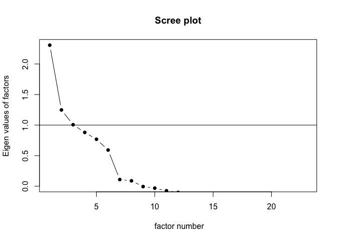
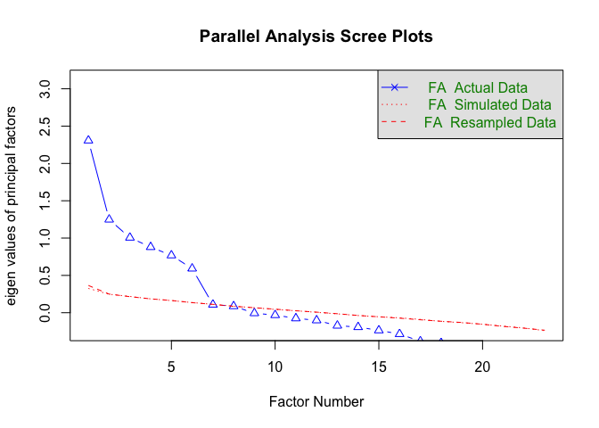
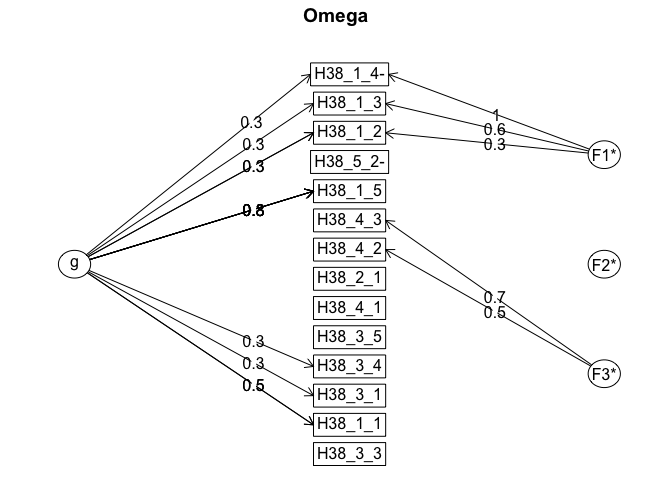

Prepare Data
================

- [Required Packages &
  Reproducibility](#required-packages--reproducibility)
- [Tidy Data](#tidy-data)
- [Factor Analyses of PNC](#factor-analyses-of-pnc)
- [Reliability of Scales](#reliability-of-scales)
- [Save Data for Analysis](#save-data-for-analysis)

## Required Packages & Reproducibility

``` r
rm(list=ls())
source(here::here("src/lib/functions.R"))
#renv::snapshot()
```

## Tidy Data

``` r
load(here("data/raw-private/cleaned_data_w2.RData")) 
load(here("data/raw-private/cleaned_data_w3.RData"))

source(here("src/data-processing/clean_data.R"))
```

## Factor Analyses of PNC

**H38** == PNC (21 questions)

``` r
source(here("src/data-processing/factor_analyses.R"))

#PCA Info
summary(res_pca)
```

    ## Importance of components:
    ##                          PC1    PC2    PC3    PC4    PC5    PC6    PC7    PC8
    ## Standard deviation     1.976 1.1442 1.0876 1.0586 1.0538 1.0288 0.9934 0.9857
    ## Proportion of Variance 0.178 0.0595 0.0538 0.0509 0.0505 0.0481 0.0449 0.0442
    ## Cumulative Proportion  0.178 0.2370 0.2908 0.3417 0.3922 0.4403 0.4852 0.5293
    ##                           PC9   PC10  PC11   PC12   PC13   PC14   PC15   PC16
    ## Standard deviation     0.9810 0.9661 0.938 0.9228 0.9070 0.8844 0.8727 0.8635
    ## Proportion of Variance 0.0437 0.0424 0.040 0.0387 0.0374 0.0356 0.0346 0.0339
    ## Cumulative Proportion  0.5731 0.6155 0.656 0.6942 0.7316 0.7672 0.8018 0.8357
    ##                          PC17  PC18   PC19   PC20   PC21   PC22
    ## Standard deviation     0.8453 0.826 0.8025 0.7629 0.7350 0.6716
    ## Proportion of Variance 0.0325 0.031 0.0293 0.0265 0.0246 0.0205
    ## Cumulative Proportion  0.8682 0.899 0.9285 0.9549 0.9795 1.0000

``` r
eig_val
```

|        | eigenvalue | variance.percent | cumulative.variance.percent |
|:-------|-----------:|-----------------:|----------------------------:|
| Dim.1  |       3.91 |             17.8 |                          18 |
| Dim.2  |       1.31 |              6.0 |                          24 |
| Dim.3  |       1.18 |              5.4 |                          29 |
| Dim.4  |       1.12 |              5.1 |                          34 |
| Dim.5  |       1.11 |              5.0 |                          39 |
| Dim.6  |       1.06 |              4.8 |                          44 |
| Dim.7  |       0.99 |              4.5 |                          49 |
| Dim.8  |       0.97 |              4.4 |                          53 |
| Dim.9  |       0.96 |              4.4 |                          57 |
| Dim.10 |       0.93 |              4.2 |                          62 |
| Dim.11 |       0.88 |              4.0 |                          66 |
| Dim.12 |       0.85 |              3.9 |                          69 |
| Dim.13 |       0.82 |              3.7 |                          73 |
| Dim.14 |       0.78 |              3.6 |                          77 |
| Dim.15 |       0.76 |              3.5 |                          80 |
| Dim.16 |       0.75 |              3.4 |                          84 |
| Dim.17 |       0.71 |              3.2 |                          87 |
| Dim.18 |       0.68 |              3.1 |                          90 |
| Dim.19 |       0.64 |              2.9 |                          93 |
| Dim.20 |       0.58 |              2.6 |                          95 |
| Dim.21 |       0.54 |              2.5 |                          98 |
| Dim.22 |       0.45 |              2.0 |                         100 |

``` r
fviz_eig(res_pca, fill.var="blue")
```


``` r
var #PCA results for variables
```

    ## Principal Component Analysis Results for variables
    ##  ===================================================
    ##   Name       Description                                    
    ## 1 "$coord"   "Coordinates for the variables"                
    ## 2 "$cor"     "Correlations between variables and dimensions"
    ## 3 "$cos2"    "Cos2 for the variables"                       
    ## 4 "$contrib" "contributions of the variables"

``` r
corrplot(var$cos2, is.corr=FALSE)
```


``` r
fviz_cos2(res_pca, choice = "var", axes = 1:2)
```


``` r
fviz_pca_var(res_pca,
             col.var = "cos2", # Color by the quality of representation
             gradient.cols = c("darkorchid4", "gold", "darkorange"),
             repel = TRUE
             )
```


``` r
grid.arrange(a,b, ncol=2, top='Contribution of the variables to the first two PCs')
```


``` r
# EFA Info
KMO(df2) #Evaluate data, scores <0.5 should be removed (0 in our case)
```

    ## Kaiser-Meyer-Olkin factor adequacy
    ## Call: KMO(r = df2)
    ## Overall MSA =  0.81
    ## MSA for each item = 
    ## H38_1_1 H38_1_2 H38_1_3 H38_1_4 H38_1_5 H38_2_1 H38_2_2 H38_2_3 H38_3_1 H38_3_2 
    ##    0.83    0.70    0.69    0.71    0.84    0.78    0.78    0.76    0.87    0.87 
    ## H38_3_3 H38_3_4 H38_3_5 H38_3_6 H38_3_7 H38_4_1 H38_4_2 H38_4_3 H38_4_4 H38_4_5 
    ##    0.90    0.84    0.86    0.83    0.82    0.82    0.87    0.85    0.81    0.72 
    ## H38_5_1 H38_5_2 
    ##    0.85    0.81

``` r
cortest.bartlett(df2)#Bartlett’s test for sphericity
```

    ## $chisq
    ## [1] 2498
    ## 
    ## $p.value
    ## [1] 0
    ## 
    ## $df
    ## [1] 231

``` r
ev$values
```

    ##  [1] 3.87 1.37 1.23 1.17 1.09 1.07 1.03 0.98 0.94 0.90 0.88 0.86 0.83 0.77 0.75
    ## [16] 0.72 0.70 0.66 0.61 0.59 0.55 0.46

``` r
scree(df2, pc=FALSE) 
```



``` r
fa.parallel(df2, fa="fa")
```



    ## Parallel analysis suggests that the number of factors =  8  and the number of components =  NA

``` r
print(fit, digits=2, cutoff=0.3, sort=TRUE)
```

    ## 
    ## Call:
    ## factanal(x = df2, factors = Nfacs, rotation = "promax")
    ## 
    ## Uniquenesses:
    ## H38_1_1 H38_1_2 H38_1_3 H38_1_4 H38_1_5 H38_2_1 H38_2_2 H38_2_3 H38_3_1 H38_3_2 
    ##    0.69    0.75    0.00    0.80    0.52    0.74    0.21    0.84    0.82    0.87 
    ## H38_3_3 H38_3_4 H38_3_5 H38_3_6 H38_3_7 H38_4_1 H38_4_2 H38_4_3 H38_4_4 H38_4_5 
    ##    0.81    0.78    0.81    0.83    0.83    0.85    0.92    0.78    0.86    0.90 
    ## H38_5_1 H38_5_2 
    ##    0.78    0.78 
    ## 
    ## Loadings:
    ##         Factor1 Factor2 Factor3 Factor4 Factor5
    ## H38_1_5  0.54                                  
    ## H38_1_3                  0.98                  
    ## H38_2_2                          0.91          
    ## H38_1_1          0.48                          
    ## H38_1_2  0.50                                  
    ## H38_1_4          0.46                          
    ## H38_2_1                                  0.47  
    ## H38_2_3  0.47                                  
    ## H38_3_1  0.36                                  
    ## H38_3_2                                        
    ## H38_3_3                                        
    ## H38_3_4  0.37                                  
    ## H38_3_5          0.40                          
    ## H38_3_6  0.36                                  
    ## H38_3_7          0.37                          
    ## H38_4_1                                  0.31  
    ## H38_4_2                                        
    ## H38_4_3                                        
    ## H38_4_4                                        
    ## H38_4_5          0.36                          
    ## H38_5_1                                        
    ## H38_5_2                                  0.50  
    ## 
    ##                Factor1 Factor2 Factor3 Factor4 Factor5
    ## SS loadings       1.36    1.18    1.04    0.97    0.92
    ## Proportion Var    0.06    0.05    0.05    0.04    0.04
    ## Cumulative Var    0.06    0.12    0.16    0.21    0.25
    ## 
    ## Factor Correlations:
    ##         Factor1 Factor2 Factor3 Factor4 Factor5
    ## Factor1    1.00   -0.15    0.17   -0.23   -0.17
    ## Factor2   -0.15    1.00   -0.35    0.42    0.34
    ## Factor3    0.17   -0.35    1.00   -0.55   -0.54
    ## Factor4   -0.23    0.42   -0.55    1.00    0.44
    ## Factor5   -0.17    0.34   -0.54    0.44    1.00
    ## 
    ## Test of the hypothesis that 5 factors are sufficient.
    ## The chi square statistic is 290 on 131 degrees of freedom.
    ## The p-value is 5.2e-14

``` r
load <- fit$loadings[,1:2]
plot(load,type="n") # set up plot
text(load,labels=names(df2),cex=.7)
```


``` r
fa.diagram(loads)
```


``` r
# CFA Info
```

## Reliability of Scales

**H38** == PNC (21 questions) **H36** == NFC (6 questions) **H37** ==
TOA (13 questions) **H40** == MCE (14 questions) – if H40_i == 1, we
move on to H41_i and H42_i

``` r
source(here("src/data-processing/scales.R"))
```



``` r
pnc_omega
```

    ## Omega 
    ## Call: omegah(m = m, nfactors = nfactors, fm = fm, key = key, flip = flip, 
    ##     digits = digits, title = title, sl = sl, labels = labels, 
    ##     plot = plot, n.obs = n.obs, rotate = rotate, Phi = Phi, option = option, 
    ##     covar = covar)
    ## Alpha:                 0.69 
    ## G.6:                   0.7 
    ## Omega Hierarchical:    0.49 
    ## Omega H asymptotic:    0.67 
    ## Omega Total            0.73 
    ## 
    ## Schmid Leiman Factor loadings greater than  0.2 
    ##            g   F1*   F2*   F3*   h2   u2   p2
    ## H38_1_1 0.49              0.87 1.00 0.00 0.24
    ## H38_1_2 0.28  0.26             0.18 0.82 0.44
    ## H38_1_3 0.28                   0.11 0.89 0.67
    ## H38_1_4 0.20                   0.11 0.89 0.35
    ## H38_1_5 0.60  0.59             0.71 0.29 0.51
    ## H38_2_1 0.23        0.32       0.16 0.84 0.33
    ## H38_3_1 0.34        0.22       0.18 0.82 0.63
    ## H38_3_3 0.36        0.26       0.21 0.79 0.62
    ## H38_3_4 0.33  0.22             0.17 0.83 0.65
    ## H38_3_5 0.28        0.21       0.14 0.86 0.57
    ## H38_4_1 0.24        0.29       0.14 0.86 0.40
    ## H38_4_2 0.20                   0.07 0.93 0.58
    ## H38_4_3 0.26                   0.11 0.89 0.62
    ## H38_5_2 0.29        0.30       0.17 0.83 0.47
    ## 
    ## With Sums of squares  of:
    ##    g  F1*  F2*  F3* 
    ## 1.53 0.54 0.56 0.84 
    ## 
    ## general/max  1.8   max/min =   1.6
    ## mean percent general =  0.51    with sd =  0.14 and cv of  0.27 
    ## Explained Common Variance of the general factor =  0.44 
    ## 
    ## The degrees of freedom are 52  and the fit is  0.17 
    ## The number of observations was  1000  with Chi Square =  164  with prob <  1.4e-13
    ## The root mean square of the residuals is  0.03 
    ## The df corrected root mean square of the residuals is  0.04
    ## RMSEA index =  0.046  and the 10 % confidence intervals are  0.039 0.055
    ## BIC =  -195
    ## 
    ## Compare this with the adequacy of just a general factor and no group factors
    ## The degrees of freedom for just the general factor are 77  and the fit is  0.38 
    ## The number of observations was  1000  with Chi Square =  379  with prob <  2.2e-41
    ## The root mean square of the residuals is  0.07 
    ## The df corrected root mean square of the residuals is  0.07 
    ## 
    ## RMSEA index =  0.063  and the 10 % confidence intervals are  0.056 0.069
    ## BIC =  -153 
    ## 
    ## Measures of factor score adequacy             
    ##                                                  g   F1*   F2*  F3*
    ## Correlation of scores with factors            0.75  0.64  0.58 0.93
    ## Multiple R square of scores with factors      0.56  0.41  0.34 0.86
    ## Minimum correlation of factor score estimates 0.12 -0.18 -0.33 0.72
    ## 
    ##  Total, General and Subset omega for each subset
    ##                                                  g  F1*  F2*  F3*
    ## Omega total for total scores and subscales    0.73 0.57 0.56 1.00
    ## Omega general for total scores and subscales  0.49 0.35 0.32 0.24
    ## Omega group for total scores and subscales    0.17 0.23 0.25 0.76

``` r
rel_scales
```


## Save Data for Analysis

``` r
d <- d |> 
  select(id:E2_2, PNC, TOA, NFC, MCE)
save(d, file = here("data/intermediate/data_for_analyses.RData"))
```
